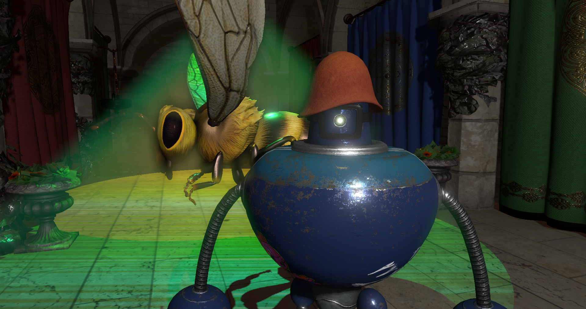
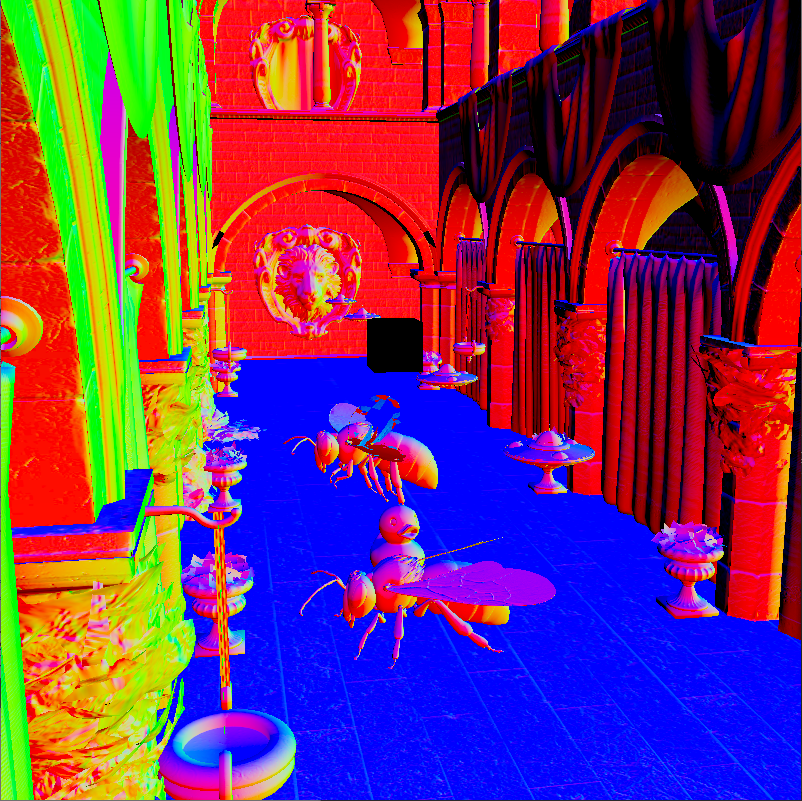
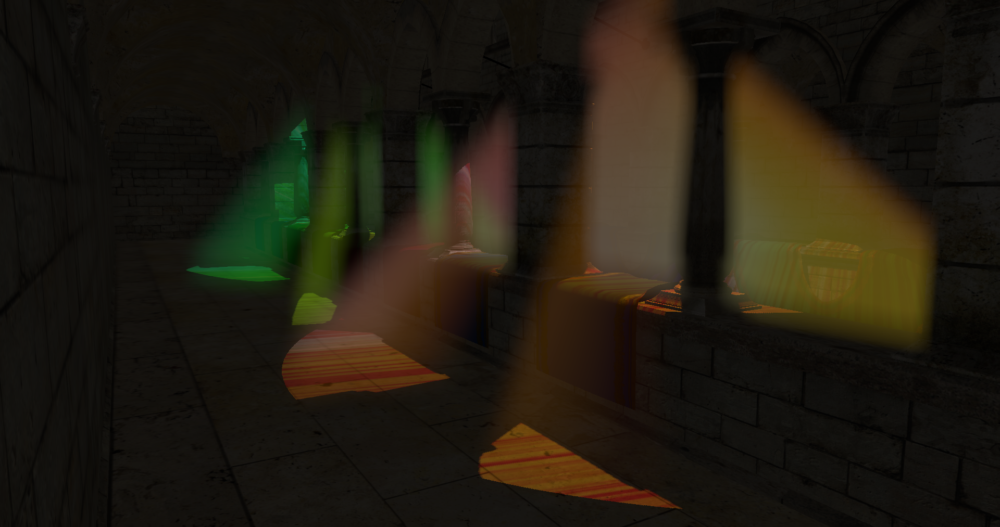
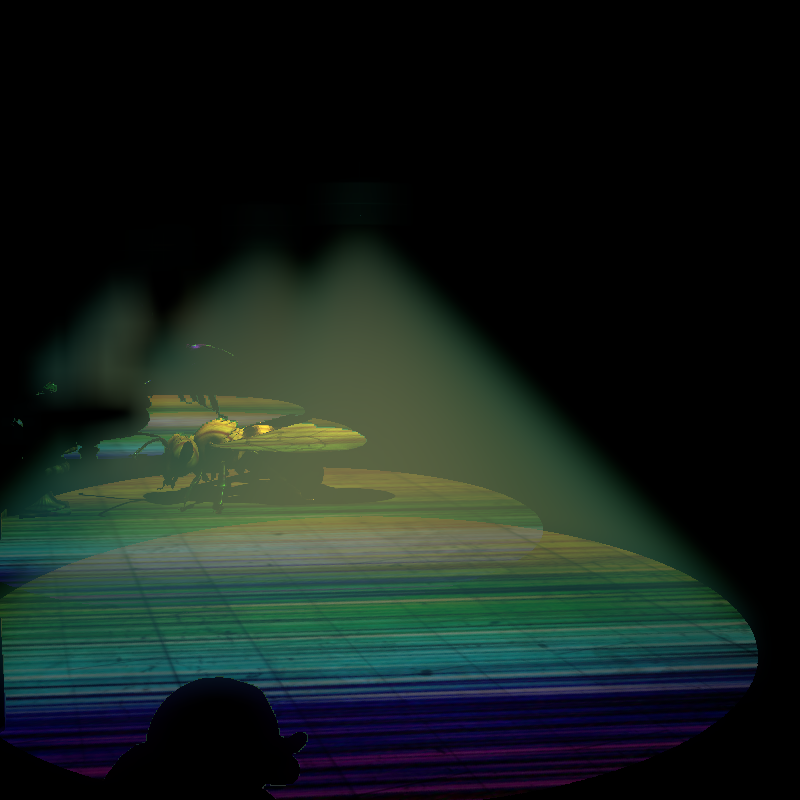

# Vulkan C++ application

 

## Что это

Данное приложение осуществляет рендеринг сцены с помощью Vulkan API. Основные файлы с кодом лежат в папке core, сторонние библиотеки лежат в папке libs, дополнительные ресурсы в виде моделей и текстур находятся в папках model и texture соответственно. Проект выполнен в Qt Creator.

## Схема приложения

## Что реализовано

* Базовая отрисовка 3D геометрии. Текстурирование.
* Освещение прожекторными и точечными источниками.
* Мягкие тени.
* Отрисовка в различные цветовые прикрепления.
* Многопроходный рендеринг. В частности осуществляется 2 прохода - в первом осуществляется отрисовка моделей, во втором - работа над изображением, например, размытие по Гауссу.
* Рендер glTF моделей на основе [загрузчика glTF](https://github.com/SaschaWillems/Vulkan-glTF-PBR), переработанного под данную реализацию приложения Vulkan.
* Анимация. Линейная интерполяция между анимациями (На картинке передняя пчела плавно меняет свою анимацию на анимацию полёта, как у задней пчелы, и обратно)

* Группировка объектов (в том числе источников света и камеры) и управление группами.
* Поддержка нескольких буферов кадра
* Мультисемплинг.
* Создание MIP-карт.
* Скайбокс

* Отложенный рендеринг (за счёт подпроходов рендера)

 
 

* Объёмный свет

* Screen Space Local Reflections

* Использование трафаретного буфера для выделения объектов (возможность включать и выключать выделение) 

* Прототип обьёмных источников света (сферические источники, плоскости)

* Буфер, который можно считывать со стороны CPU, благодаря чему можно распознавать объекты под курсором
* Простая физика объектов

## Оптимизация

Для каждого источника света выделен свой отдельный vkCmdDraw, в котором рисуется пирамида (её внутренняя поверхность), соответствующая его матрицам проекции и вида. Далее фрагментный шейдер проходит только по фрагментам пирамиды, соответствующей этому источнику, таким образом не “освещая” те фрагменты, на которые точно не падает свет. Результаты каждого прохода смешиваются, выбирая максимальный цвет. Мы имеем изображение, в котором отрисованы и окрашены все видимые конусы света. Для хорошего результата, следует сделать финальный проход, в котором мы просто зададим амбиентное освещение всего окружения, которое не попало ни в один конус. 
 

В итоге мы имеем то же самое изображение отложенного освещения, но рисуется оно гораздо быстрее. Так же разделение отрисовки отдельным vkCmdDraw для каждого источника света, позволяет задать различные конвейеры и соответственно шейдеры для источников света. Это позволяет рендерить различные эффекты для разных типов освещения без вреда производительности, например, для некоторых источников можно задать рассеяние света в среде (объёмный свет) или не рисовать тени. Таким образом, вместо ветвлений логики шейдера, ухудшающих производительность, можно написать много шейдеров для разных типов света, избавляя машину от лишних вычислений. Так же визуализация конусов оптимизирует отрисовку объёмного освещения – точки конуса служат очень точным ориентиром для реймарчинга, поэтому вместо использования точек окружения или танцев с бубном вокруг модельной и видовой матрицы камеры, мы можем просто шагать к каждой точке конуса вдоль направления луча, собирая свет от точек, попавших внутрь конуса. Получающийся результат является очень приличным. Немного цифр – до оптимизации моя мобильная GTX 1050 выдавала 20-22 fps для 10 источников света, 4 из которых рассеивали свет. После оптимизации я получаю 35-70 fps в зависимости от того сколько конусов попадает в поле зрения, среднее значение около 60. Данный метод позволяет менее болезненно добавлять новые источники. Так сцена с +10 дополнительными источниками света с рассеиванием даёт примерно те же 40-60fps. Всё зависит в действительности не от того какое количество источников есть в сцене, а то сколько освещённых фрагментов попадает в поле зрения.

