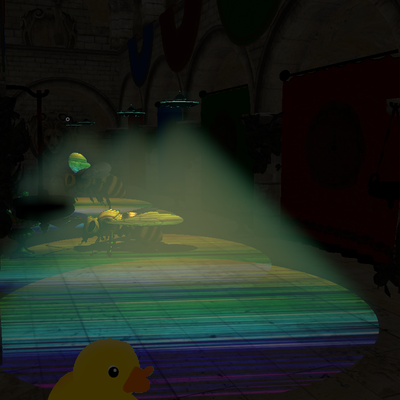

# Vulkan C++ application

 

## About

This application makes render of scene by Vulkan API and contains some modern graphics effects, which I will give below.

## Application scheme

## Content

* Base render of 3D geometry and texturing.
* Spot and point light sources with shadows.
* Reneder in several attachments.
* Two pass render - first pass draw and shade scene, second pass is post processing.
* glTF models render based on [repository of Sascha Willems](https://github.com/SaschaWillems/Vulkan-glTF-PBR), redesigned for this implementation of the Vulkan application.
* Animations and linear interpolation between Animations

* Groups of objects, light sources, camera and groups manipulations.
* Using three frame buffers.
* MSAA.
* MIP-maps.
* Skybox

* Bloom by bliting of source image

* deferred render by subpasses

 
 

* Volumetric light

* Screen Space Local Reflections

* Using stencil buffer for highlighting objects

* Prototype of area light (sphere sources and surfaces)

* Store buffer, which can be readen by CPU, for example, I used it for detect object under cursor
* Simple physics

## Optimization

I use a single vkCmdDraw for each light sources, in which every single pass draw inside surface of piramid, corresponded projection and view matrixes of light source. Fragment shader works only with pyramid fragments of this light point. We do not shade points out of light volume by this way. Results of every light pass is blended in attachment using function of maximum. We have image with lighted fragments of pyramids. For normal result I do final pass of ambient light. It fills fragments which outs of light pyramids.
 

Eventually we have same image of deferred render, but calculations are more fast. Also differentiation of light sources calculations lets using various pipelines and shaders for every light source. It lets us render variose effects without performance drop. In fact performance depends on count of shaded fragments and do not depend on light sources count.

