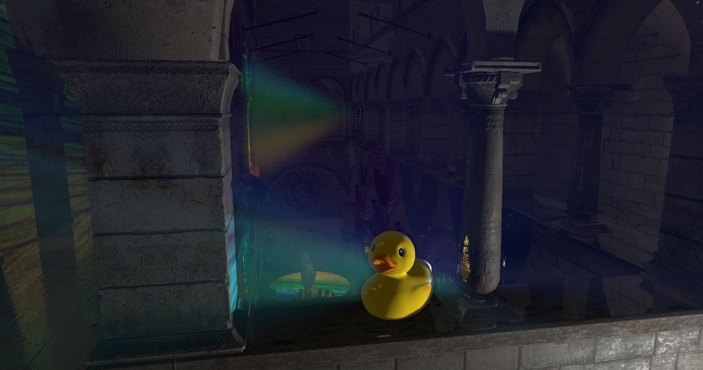
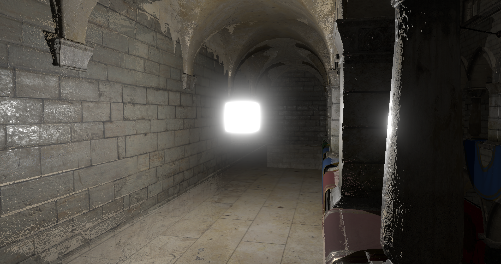
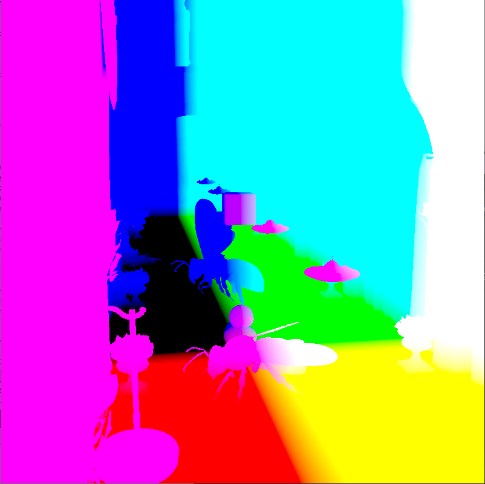
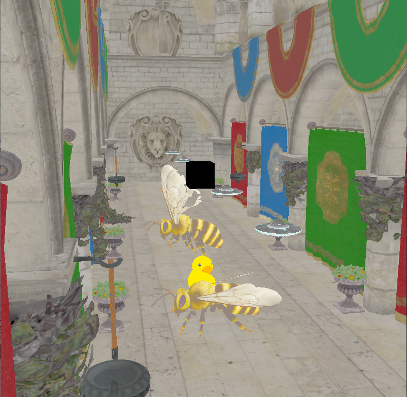

# Vulkan C++ application

  

## Что это

Данное приложение осуществляет рендеринг сцены с помощью Vulkan API. Основные файлы с кодом лежат в папке core, сторонние библиотеки лежат в папке libs, дополнительные ресурсы в виде моделей и текстур находятся в папках model и texture соответственно. Проект выполнен в Qt Creator.

## Что реализовано

* Базовая отрисовка 3D геометрии. Текстурирование.
* Освещение прожекторными и точечными источниками.
* Мягкие тени.
* Отрисовка в различные цветовые прикрепления.
* Многопроходный рендеринг. В частности осуществляется 2 прохода - в первом осуществляется отрисовка моделей, во втором - работа над изображением, например, размытие или добавление эффекта god rays (motion blur).
* Рендер glTF моделей на основе [загрузчика glTF](https://github.com/SaschaWillems/Vulkan-glTF-PBR), переработанного под данную реализацию приложения Vulkan.
* Анимация.

* Группировка объектов (в том числе источников света и камеры) и управление группами.
* Поддержка нескольких буферов кадра
* Мультисемплинг.
* Создание MIP-карт.
* Скайбокс (на картинке эффект радиального размытия от скайбокса)

* Отложенный рендеринг
 
 