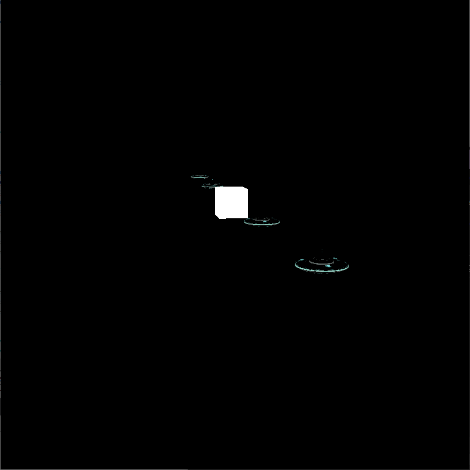
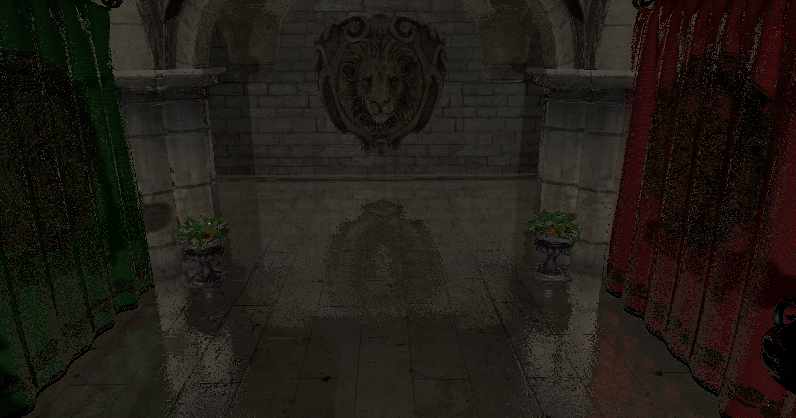

# Vulkan C++ application

  

## Что это

Данное приложение осуществляет рендеринг сцены с помощью Vulkan API. Основные файлы с кодом лежат в папке core, сторонние библиотеки лежат в папке libs, дополнительные ресурсы в виде моделей и текстур находятся в папках model и texture соответственно. Проект выполнен в Qt Creator.

## Что реализовано

* Базовая отрисовка 3D геометрии. Текстурирование.
* Освещение прожекторными и точечными источниками.
* Мягкие тени.
* Отрисовка в различные цветовые прикрепления.
* Многопроходный рендеринг. В частности осуществляется 2 прохода - в первом осуществляется отрисовка моделей, во втором - работа над изображением, например, размытие по Гауссу.
* Рендер glTF моделей на основе [загрузчика glTF](https://github.com/SaschaWillems/Vulkan-glTF-PBR), переработанного под данную реализацию приложения Vulkan.
* Анимация. Линейная интерполяция между анимациями (На картинке передняя пчела плавно меняет свою анимацию на анимацию полёта, как у задней пчелы, и обратно)

* Группировка объектов (в том числе источников света и камеры) и управление группами.
* Поддержка нескольких буферов кадра
* Мультисемплинг.
* Создание MIP-карт.
* Скайбокс

* Отложенный рендеринг (за счёт подпроходов рендера)

 
 

* Объёмный свет

* Screen Space Local Reflections

* Использование трафаретного буфера для выделения объектов (возможность включать и выключать выделение) 

* Прототип обьёмных источников света (сферические источники, плоскости)

* Буфер, который можно считывать со стороны CPU, благодаря чему можно распознавать объекты под курсором
* Простая физика объектов

